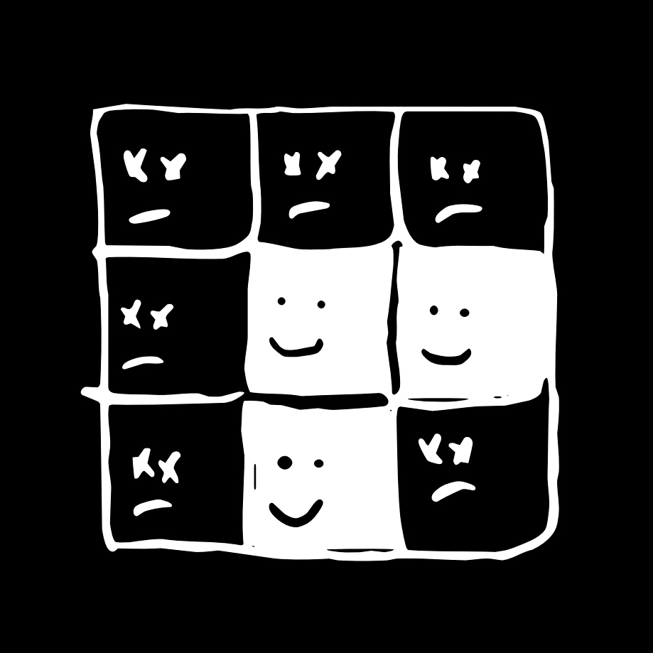

# Game-of-life

## Overview
When i first heard about the Game of Life, i was inspired to implement it simply because of its clear and simple rules, plus this fun personal project was a great learning opportunity.

### **About the Game**
GOL is a **zero-player** game consisting of a lattice of 'live' and 'dead' cells, where the configuration of each generation is determined by the configuration of the previous generation and a set of **four simple immutable rules**. This means that **generation zero** is the only variable and will determine the fate of all cells in future generations. As a result, interesting patterns occur. you can read more about the game [here](https://en.wikipedia.org/wiki/Conway%27s_Game_of_Life).

#### **Game rules:**
1. Any live cell with fewer than two live neighbours dies.
2. Any live cell with two or three live neighbours lives on to the next generation.
3. Any live cell with more than three live neighbours dies.
4. Any dead cell with exactly three live neighbours becomes a live cell.

## **Features**
When you run this simple [script](https://github.com/adeoo/Game-of-life/blob/main/GOF.py), a *600 x 600* window will pop up, containing a lattice and a random generation zero, it will then proceed to play the game. close the window to terminate the script. 

## **Screenshot**

  

